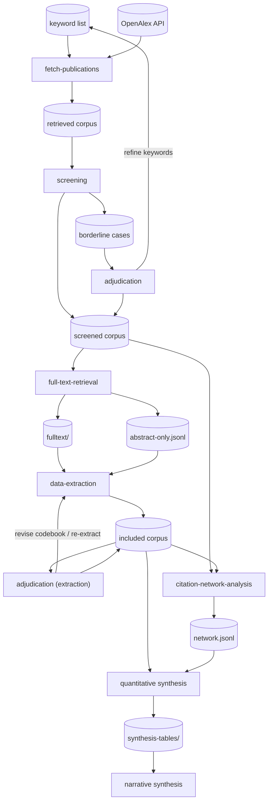

# Proposal B: Iterative Convergence with Feedback Loops

## Overview

The pipeline is not a conveyor belt. Discovery and screening inform each
other, full-text evidence shapes what questions we ask, and human judgment acts
as a valve at several points. The result is a graph with two feedback loops:
one tightening the search, one refining the codebook. A dedicated
citation-network stage contextualises prevalence findings.

## Stages

### 1. fetch-publications *(exists)*

Keyword search against OpenAlex returns validated `Work` records with title,
abstract, authors, date, topics, and citation graph edges. This is the raw
material for everything downstream.

- **Consumes:** keyword list, OpenAlex API
- **Produces:** retrieved corpus — raw Work records

### 2. screening *(exists)*

A local LLM scores each abstract for relevance. Records below a hard
threshold are dropped; those in a grey zone are flagged as borderline cases
for human review.

- **Consumes:** retrieved corpus
- **Produces:** screened corpus — scored and verdicted Work records, plus a
  set of borderline cases

### 3. adjudication

A human reviewer examines the borderline cases, correcting verdicts.
Crucially, patterns observed here — systematic misses or false positives —
**feed back to Stage 1 as refined keywords or to Stage 2 as codebook
refinements**. This is the first feedback loop, and it keeps the search-and-screening
pair honest.

- **Consumes:** borderline cases
- **Produces:** corrected verdicts merged back into the screened corpus; updated
  keyword list and/or LLM codebook refinements

### 4. full-text-retrieval

For each record that passes screening, the pipeline retrieves the full text
(open-access PDF or author manuscript). Papers that don't resolve are retained
as abstract-only works. Full text is the precondition for answering RQ1.1
(Reproducibility) and RQ1.3 (Rationale).

- **Consumes:** screened corpus (DOIs, OA links)
- **Produces:** `fulltext/` — one document per resolved paper;
  `abstract-only.jsonl` for unresolved records

### 5. data-extraction

An LLM reads each document and populates a fixed set of fields defined by the
codebook and aligned to the research questions: sub-discipline classification,
numerical methods mentioned, reproducibility assessment, and stated rationale.
Abstract-only works receive a partial extraction with lower confidence scores.

- **Consumes:** `fulltext/`, `abstract-only.jsonl`, codebook
- **Produces:** included corpus — one extraction record per paper

### 6. adjudication (extraction)

A human reviewer samples extraction records and assesses extraction quality:
are fields populated correctly, are categories too coarse, are there emergent
numerical choices not anticipated by the codebook? Findings **feed back to
Stage 5** to refine prompts or extend the codebook before full-scale data
extraction is committed. This is the second feedback loop.

- **Consumes:** sample of extraction records
- **Produces:** revised codebook; corrected records merged back into the
  included corpus

### 7. citation-network-analysis

The citation graph embedded in the Work records identifies foundational
methodological papers (high centrality within the corpus), clusters of papers
sharing numerical lineages, and papers that are isolated from the main
methodological conversation. This contextualises the prevalence counts and
reveals whether numerical choices propagate by citation inheritance or arise
independently.

- **Consumes:** screened corpus (citation edges), included corpus (method
  labels)
- **Produces:** `network.jsonl` — per-paper centrality scores, cluster
  assignments, lineage flags

### 8. quantitative synthesis

Extraction records are aggregated to answer each research question directly.
RQ1.1 (Reproducibility) -> reproducibility counts by sub-discipline. RQ1.2
(Prevalence) -> method prevalence by sub-discipline and year. RQ1.3 (Rationale)
-> thematic synthesis of grouped rationales by method. Citation network results
annotate each finding with provenance context. Outputs are structured tables,
not prose.

- **Consumes:** included corpus, `network.jsonl`
- **Produces:** `synthesis-tables/` — per-RQ summary tables and distributions

### 9. narrative-synthesis

The research team interprets the synthesis tables and writes manuscript
sections. An LLM may assist with drafting, but all interpretive claims are
human-authored. The pipeline ends here and hands off to the researchers.

- **Consumes:** `synthesis-tables/`, researcher judgment
- **Produces:** manuscript sections (outside the pipeline)

## Key difference: two feedback loops

### Search–screening loop

Human adjudication findings refine keywords
and screening calibration.

### Extract–codebook loop

Human adjudication of extraction records
refines the codebook before committing to full-scale runs.

## Pipeline flowchart

