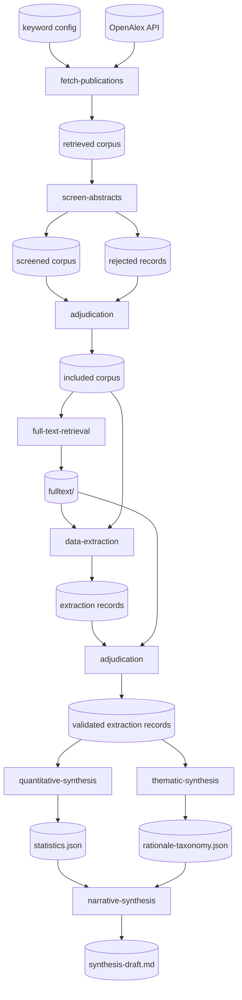

# Proposal C: Synthesis-Heavy with Quantitative/Qualitative Split

## Overview

This proposal spends more design effort on what happens *after* the included
corpus exists. The key insight is that RQ1.3 (why are choices made?) requires
a fundamentally different analytical method (thematic clustering) than RQ1.1
and RQ1.2 (counting and tabulation), so the synthesis end forks into separate
quantitative and qualitative tracks before recombining.

## Stages

### 1. fetch-publications *(exists)*

Queries OpenAlex using domain-specific keyword sets and retrieves validated
bibliographic records. The output is intentionally broad — it captures the
full relevant search space before any screening.

- **Consumes:** OpenAlex API, keyword query configuration
- **Produces:** retrieved corpus — unscreened work records

### 2. screen-abstracts *(exists)*

Applies a local LLM to score each abstract for relevance, assigning a verdict
and confidence score. The dual output — retained and rejected — allows
auditing of borderline cases.

- **Consumes:** retrieved corpus
- **Produces:** screened corpus, rejected records

### 3. adjudication

A human reviewer inspects a stratified sample of accepted and rejected records
to validate screening quality and adjust thresholds. Borderline-scored records
receive priority attention. Produces a reconciled, human-approved corpus.

- **Consumes:** screened corpus, rejected records
- **Produces:** included corpus — reconciled, human-approved records

### 4. full-text-retrieval

Retrieves full paper text via open-access sources, DOI resolution, or
institutional access. Papers not retrievable fall back to abstract-only
processing, which is tracked explicitly. Full text is essential for RQ1.1
(Reproducibility) and RQ1.3 (Rationale).

- **Consumes:** included corpus (DOIs, URLs)
- **Produces:** `fulltext/` — retrieved documents; retrieval-status flag on
  each record

### 5. data-extraction

An LLM processes each paper against a fixed codebook pulling out:
sub-discipline classification (water parcels / tracers / objects), numerical
integration scheme, time-step strategy, interpolation method, code or method
availability, and stated rationale for numerical choices. Each extraction
record flags its source basis (full text vs. abstract-only).

- **Consumes:** included corpus, `fulltext/`
- **Produces:** extraction records — one structured record per paper

### 6. adjudication (extraction)

Spot-checks a random sample of extraction records, verifying extracted facts
match the source text. Corrections are written back. Inter-rater agreement
metrics are recorded to support methodological transparency in the eventual
publication.

- **Consumes:** extraction records, `fulltext/`
- **Produces:** validated extraction records — corrected records plus a
  validation log

### 7. quantitative-synthesis

Validated extraction records are aggregated to produce quantitative answers to
RQ1.1 (Reproducibility) and RQ1.2 (Prevalence): fraction of papers providing
reproducible detail, distribution of each numerical choice, breakdowns by
sub-discipline. Uncertainty is propagated from the source basis field
(full-text vs. abstract-only extraction records carry different confidence).

- **Consumes:** validated extraction records
- **Produces:** `statistics.json` — tabulated counts, proportions, breakdowns

### 8. thematic-synthesis

The stated rationales for numerical choices — a free-text field in the
codebook — are gathered and thematically clustered to address RQ1.3
(Rationale). An LLM assists in grouping rationales into a rationale taxonomy
(e.g., computational cost, accuracy requirements, code availability,
convention), but **final taxonomy labels are assigned and reviewed by a
human**.

- **Consumes:** validated extraction records
- **Produces:** `rationale-taxonomy.json` — coded categories with supporting
  quotations and paper references

### 9. narrative-synthesis

Statistics and rationale taxonomy are combined into a structured narrative
addressing each research question. RQ1.1 and RQ1.2 get quantitative
summaries; RQ1.3 gets qualitative findings. Gaps and limitations (unretrieved
papers, low-confidence extraction records) are explicitly flagged.

- **Consumes:** `statistics.json`, `rationale-taxonomy.json`
- **Produces:** `synthesis-draft.md` — structured narrative keyed to research
  questions, with evidence references

## Key difference: split synthesis

The synthesis end splits into three distinct stages — quantitative synthesis
(quantitative), thematic synthesis (qualitative), and narrative synthesis
(combined narrative). This reflects the fact that RQ1.3 requires thematic
clustering while RQ1.1 and RQ1.2 require counting and tabulation.

## Pipeline flowchart

