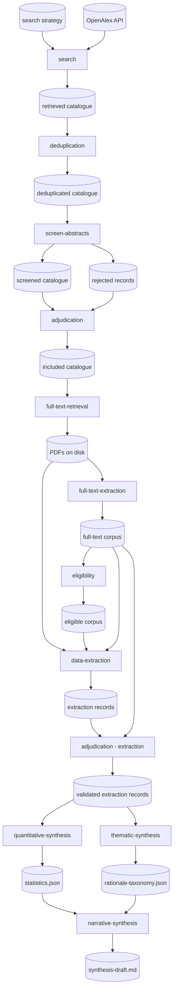

# Pipeline

Combined pipeline design, synthesized from proposals A, B, and C. Uses C's
backbone (split synthesis stages) with additions from the comparative review:
deduplication and eligibility as distinct stages.

Stages 1–4 operate on the **catalogue** (metadata + abstracts, no full text).
Stage 5 retrieves PDFs; stage 6 extracts structured text from them. From
stage 6 onward we work with the **corpus**.

## Stages

### 1. search *(exists)*

Queries OpenAlex using the search strategy and retrieves validated
bibliographic records. The output is intentionally broad — it captures the
full relevant search space before any screening. Multiple searches may be
needed to cover the three sub-disciplines (water parcels, tracers, objects).

- **Consumes:** OpenAlex API, search strategy
- **Produces:** retrieved catalogue — unscreened work records

### 2. deduplication

Removes duplicate records from the retrieved catalogue. Duplicates arise when
multiple keyword searches return overlapping result sets, or when the same
work appears under different OpenAlex IDs. Deduplication operates on metadata
(DOI, title, authors) before any screening effort is spent.

- **Consumes:** retrieved catalogue
- **Produces:** deduplicated catalogue

### 3. screen-abstracts *(exists)*

Applies a local LLM to score each abstract for relevance, assigning a verdict
and confidence score. The dual output — retained and rejected — allows
auditing of borderline cases.

- **Consumes:** deduplicated catalogue
- **Produces:** screened catalogue, rejected records

### 4. adjudication

A human reviewer inspects a stratified sample of accepted and rejected records
to validate screening quality and adjust thresholds. Borderline-scored records
receive priority attention. Produces a reconciled, human-approved catalogue.

- **Consumes:** screened catalogue, rejected records
- **Produces:** included catalogue — reconciled, human-approved records

*Optional: findings from adjudication may feed back to stage 1 (refined
keywords) or stage 3 (screening calibration). See [Optional
extensions](#optional-extensions).*

### 5. full-text-retrieval

Retrieves PDFs via open-access sources, DOI resolution, preprint servers,
or manual batch download. The output is PDFs on disk and a retrieval
status record per work. Papers not retrievable are flagged as
abstract-only. Full text is essential for RQ1.1 (Reproducibility) and
RQ1.3 (Rationale).

- **Consumes:** included catalogue (DOIs, URLs)
- **Produces:** PDFs on disk, retrieval status records (per-work retrieval
  outcome and source)

### 6. full-text-extraction

Parses retrieved PDFs into structured sections (title + body text per
section). GROBID is the extraction tool. The extraction is decoupled from
retrieval so that PDFs can also be consumed directly by other tools (e.g.
a long-context LLM reviewing a raw PDF). Not all downstream stages require
structured sections — some may work with the PDF directly.

- **Consumes:** PDFs from stage 5
- **Produces:** full-text corpus — structured section text per work;
  source basis flag on each record

### 7. eligibility

Full-text assessment of whether each work meets the review's eligibility
criteria. Distinct from screening (which uses only title and abstract).
Reading the full text may reveal that a paper is not actually about
computational Lagrangian methods, or that it is a review/meta-analysis
rather than primary research. Works that fail eligibility are excluded with
a recorded reason.

- **Consumes:** full-text corpus, eligibility criteria (defined in the
  protocol)
- **Produces:** eligible corpus — works confirmed for data extraction

### 8. data-extraction

An LLM processes each paper against the codebook, extracting: sub-discipline
classification (water parcels / tracers / objects), numerical integration
scheme, time-step strategy, interpolation method, reproducibility assessment
(code or method availability), and stated rationale for numerical choices.
Each extraction record flags its source basis (full text vs. abstract-only).

- **Consumes:** eligible corpus, full texts, codebook
- **Produces:** extraction records — one structured record per paper

### 9. adjudication (extraction)

Spot-checks a random sample of extraction records, verifying extracted facts
match the source text. Corrections are written back. Inter-rater agreement
metrics are recorded to support methodological transparency in the eventual
publication.

- **Consumes:** extraction records, full texts
- **Produces:** validated extraction records — corrected records plus a
  validation log

*Optional: findings may feed back to the codebook and trigger re-extraction.
See [Optional extensions](#optional-extensions).*

### 10. quantitative-synthesis

Validated extraction records are aggregated to produce quantitative answers to
RQ1.1 (Reproducibility) and RQ1.2 (Prevalence): fraction of papers providing
reproducible detail, distribution of each numerical choice, breakdowns by
sub-discipline. Uncertainty is propagated from the source basis field
(full-text vs. abstract-only extraction records carry different confidence).

- **Consumes:** validated extraction records
- **Produces:** `statistics.json` — tabulated counts, proportions, breakdowns

### 11. thematic-synthesis

The stated rationales for numerical choices — a free-text field in the
codebook — are gathered and thematically clustered to address RQ1.3
(Rationale). An LLM assists in grouping rationales into a rationale taxonomy
(e.g., computational cost, accuracy requirements, code availability,
convention), but **final taxonomy labels are assigned and reviewed by a
human**.

- **Consumes:** validated extraction records
- **Produces:** `rationale-taxonomy.json` — coded categories with supporting
  quotations and paper references

### 12. narrative-synthesis

Statistics and rationale taxonomy are combined into a structured narrative
addressing each research question. RQ1.1 and RQ1.2 get quantitative
summaries; RQ1.3 gets qualitative findings. Gaps and limitations (unretrieved
papers, low-confidence extraction records) are explicitly flagged.

- **Consumes:** `statistics.json`, `rationale-taxonomy.json`
- **Produces:** `synthesis-draft.md` — structured narrative keyed to research
  questions, with evidence references

## Optional extensions

These are not core pipeline stages but may be added if they prove valuable.

### Search–screening feedback loop

Adjudication findings (stage 4) feed back to refine the search strategy (stage 1) or
screening calibration (stage 3). Useful when systematic misses or false
positives reveal gaps in the search strategy. Requires convergence criteria
to avoid endless iteration.

### Extract–codebook feedback loop

Adjudication of extraction records (stage 9) feeds back to revise the
codebook and trigger re-extraction (stage 8). Useful when the codebook
categories turn out to be too coarse or when unanticipated numerical choices
emerge. Again requires convergence criteria.

### Citation-network analysis

The citation graph embedded in the work records can identify foundational
methodological papers (high centrality within the corpus) and reveal whether
numerical choices propagate by citation inheritance or arise independently.
Results would feed into quantitative synthesis (stage 10) as contextual
annotations on prevalence findings. Uses co-citation analysis and
bibliographic coupling.

### Author review

An explicit final stage where the human authors read the synthesis draft,
verify claims against source records, and finalise the manuscript sections.
Modelled as a pipeline stage (rather than an implicit post-pipeline activity)
to make the scholarly accountability step visible.

## Pipeline flowchart

